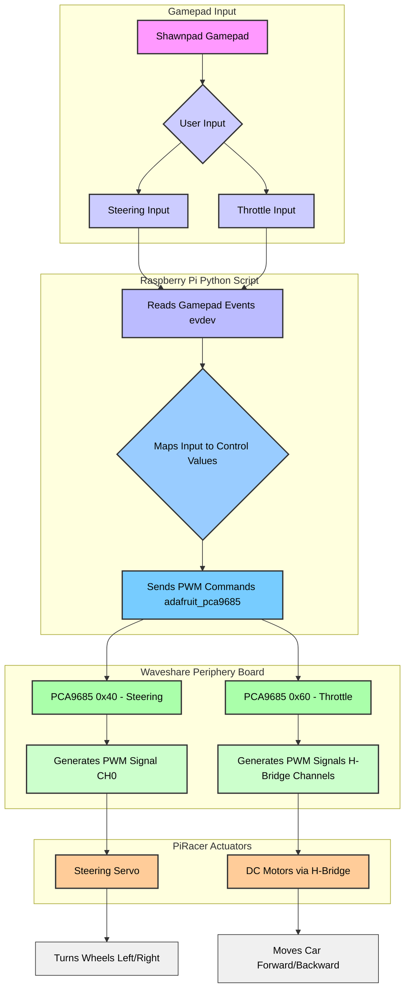

Explanation of the Signal Flow:
User Input (Shawnpad Gamepad) :

Turning Left/Right: When you push the left joystick horizontally (left for left turn, right for right turn), the gamepad generates an analog signal for the X-axis.

Throttle Forward/Backward: When you push the right joystick vertically (up for forward, down for backward), the gamepad generates an analog signal for the Y-axis.

Raspberry Pi Reads Gamepad Events (via evdev) :

The gamepad transmits these analog signals to the Raspberry Pi.

The piracer-gamepad-control.py script, running on the Raspberry Pi, uses the evdev library to continuously read raw input events from the gamepad's device file (e.g., /dev/input/event0).

It specifically detects EV_ABS (absolute axis) events:

ABS_X for the left joystick's horizontal movement (steering).

ABS_RY (or similar, depending on your gamepad) for the right joystick's vertical movement (throttle).

Maps Input to Control Values :

The raw integer values from evdev (typically -32768 to 32767 for joysticks) are mapped by the Python script to a floating-point range, usually -1.0 to 1.0.

For steering, -1.0 means full left, 0.0 is center, and 1.0 is full right.

For throttle, 1.0 means full forward, 0.0 is stop, and -1.0 means full reverse (the sign might be inverted depending on joystick orientation).

Sends PWM Commands (via adafruit_pca9685) :

The Python script then uses the adafruit_pca9685 library to send commands over the I2C bus to the appropriate PCA9685 PWM driver based on the mapped control values.

PCA9685 Generates PWM Signals :

For Steering: The PCA9685 at I2C address 0x40 receives the command for the steering angle. It generates a precise Pulse Width Modulation (PWM) signal on its Channel 0 (CH0), which is dedicated to the steering servo. The width of this pulse determines the servo's position.

For Throttle: The PCA9685 at I2C address 0x60 receives the command for motor speed/direction. It generates PWM signals on the channels connected to the H-Bridge (e.g., CH0_PWM, CH1_PWM, CH2_EN, CH3_EN as per your diagram). These signals control the H-Bridge's operation.

Controls Steering Servo (Turns Left/Right) :

The PWM signal from PCA9685 (0x40, CH0) is sent to the steering servo.

The servo rotates its arm to the commanded angle, physically turning the PiRacer's front wheels left or right.

Controls DC Motors via H-Bridge (Forward/Backward) :

The PWM signals from PCA9685 (0x60) are sent to the H-Bridge.

The H-Bridge interprets these signals to control the dual DC motors, causing them to spin forward or backward at the commanded speed, moving the PiRacer accordingly.

