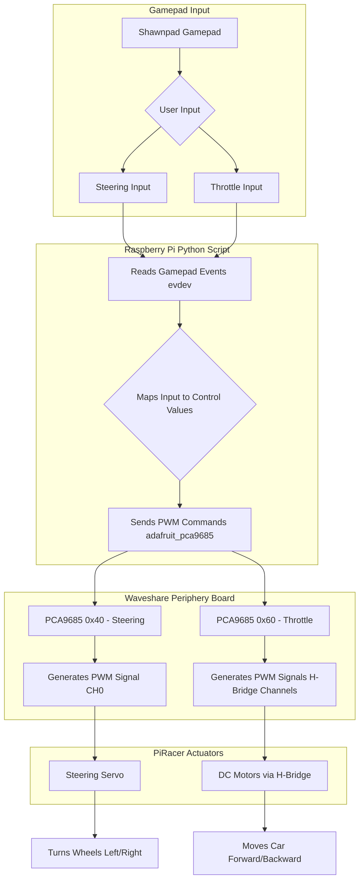

# PiRacer Control System

This document explains the signal flow and control architecture for the PiRacer autonomous vehicle system.

## System Architecture

The PiRacer control system consists of four main components:
- **Gamepad Input**: Shawnpad gamepad for user control
- **Raspberry Pi Processing**: Python script for input processing and command generation
- **Waveshare Periphery Board**: I2C PWM controllers for signal generation
- **PiRacer Actuators**: Servo and DC motors for physical control

## Signal Flow Diagram

## Detailed Signal Flow Explanation

### 1. User Input (Shawnpad Gamepad) 🎮

**Turning Left/Right:** When you push the **left joystick horizontally** (left for left turn, right for right turn), the gamepad generates an analog signal for the X-axis.

**Throttle Forward/Backward:** When you push the **right joystick vertically** (up for forward, down for backward), the gamepad generates an analog signal for the Y-axis.

### 2. Raspberry Pi Reads Gamepad Events (via `evdev`) 💻

- The gamepad transmits these analog signals to the Raspberry Pi.
- The `piracer-gamepad-control.py` script, running on the Raspberry Pi, uses the `evdev` library to continuously read raw input events from the gamepad's device file (e.g., `/dev/input/event0`).
- It specifically detects `EV_ABS` (absolute axis) events:
  - `ABS_X` for the left joystick's horizontal movement (steering).
  - `ABS_RY` (or similar, depending on your gamepad) for the right joystick's vertical movement (throttle).

### 3. Maps Input to Control Values 📏

- The raw integer values from `evdev` (typically -32768 to 32767 for joysticks) are **mapped** by the Python script to a floating-point range, usually **-1.0 to 1.0**.
  - For steering, -1.0 means full left, 0.0 is center, and 1.0 is full right.
  - For throttle, 1.0 means full forward, 0.0 is stop, and -1.0 means full reverse (the sign might be inverted depending on joystick orientation).

### 4. Sends PWM Commands (via `adafruit_pca9685`) ➡️

- The Python script then uses the `adafruit_pca9685` library to send commands over the **I2C bus** to the appropriate PCA9685 PWM driver based on the mapped control values.

### 5. PCA9685 Generates PWM Signals ⚙️

**For Steering:** The PCA9685 at I2C address `0x40` receives the command for the steering angle. It generates a precise **Pulse Width Modulation (PWM) signal** on its **Channel 0 (CH0)**, which is dedicated to the steering servo. The width of this pulse determines the servo's position.

**For Throttle:** The PCA9685 at I2C address `0x60` receives the command for motor speed/direction. It generates PWM signals on the channels connected to the **H-Bridge** (e.g., CH0_PWM, CH1_PWM, CH2_EN, CH3_EN as per your diagram). These signals control the H-Bridge's operation.

### 6. Controls Steering Servo (Turns Left/Right) ↩️

- The PWM signal from PCA9685 (`0x40`, CH0) is sent to the **steering servo**.
- The servo rotates its arm to the commanded angle, physically **turning the PiRacer's front wheels left or right**.

### 7. Controls DC Motors via H-Bridge (Forward/Backward) ⬆️⬇️

- The PWM signals from PCA9685 (`0x60`) are sent to the **H-Bridge**.
- The H-Bridge interprets these signals to control the **dual DC motors**, causing them to spin **forward or backward** at the commanded speed, moving the PiRacer accordingly.

## Technical Specifications

### Hardware Components
- **Microcontroller**: Raspberry Pi
- **PWM Controllers**: Dual PCA9685 (I2C addresses 0x40, 0x60)
- **Input Device**: Shawnpad Gamepad
- **Actuators**: Servo motor (steering), DC motors (propulsion)
- **Motor Driver**: H-Bridge circuit

### Software Libraries
- `evdev`: Linux input event interface
- `adafruit_pca9685`: PCA9685 PWM driver library
- Custom mapping algorithms for input processing

### Communication Protocols
- **I2C**: Inter-integrated circuit communication between Raspberry Pi and PCA9685 controllers
- **PWM**: Pulse Width Modulation for servo and motor control
- **USB/Bluetooth**: Gamepad connectivity (depending on model)

## Control Mapping

| Input | Range | Output | Function |
|-------|--------|---------|----------|
| Left Joystick X | -32768 to 32767 | -1.0 to 1.0 | Steering Control |
| Right Joystick Y | -32768 to 32767 | -1.0 to 1.0 | Throttle Control |

## Installation and Usage

1. Connect the Shawnpad gamepad to the Raspberry Pi
2. Ensure the Waveshare periphery board is properly wired to the I2C bus
3. Install required Python libraries: `evdev`, `adafruit_pca9685`
4. Run `piracer-gamepad-control.py` script
5. Use gamepad joysticks to control the PiRacer

## System Requirements

- Raspberry Pi with I2C enabled
- Python 3.x
- Waveshare PiRacer periphery board
- Compatible gamepad (Shawnpad or similar)
- Proper power supply for motors and servo
