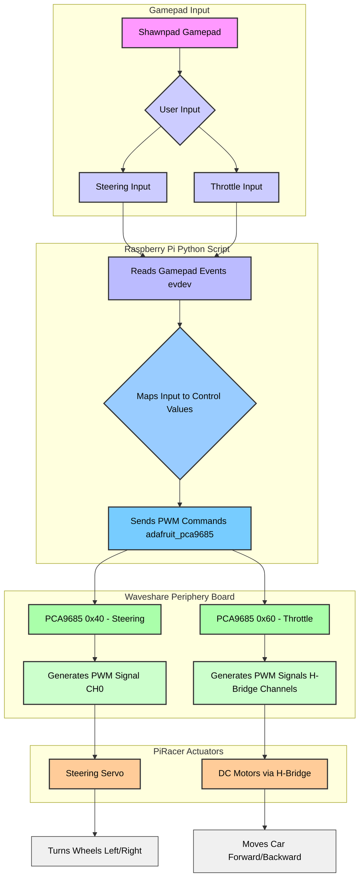

```mermaid
graph TD
    subgraph "Gamepad Input"
        A[Shawnpad Gamepad] --> B{User Input}
        B --> C[Steering Input]
        B --> D[Throttle Input]
    end

    subgraph "Raspberry Pi Python Script"
        C --> E[Reads Gamepad Events evdev]
        D --> E
        E --> F{Maps Input to Control Values}
        F --> G[Sends PWM Commands adafruit_pca9685]
    end

    subgraph "Waveshare Periphery Board"
        G --> H1[PCA9685 0x40 - Steering]
        G --> H2[PCA9685 0x60 - Throttle]
        H1 --> I[Generates PWM Signal CH0]
        H2 --> J[Generates PWM Signals H-Bridge Channels]
    end

    subgraph "PiRacer Actuators"
        I --> K[Steering Servo]
        J --> L[DC Motors via H-Bridge]
    end

    K --> M[Turns Wheels Left/Right]
    L --> N[Moves Car Forward/Backward]

    style A fill:#f9f,stroke:#333,stroke-width:2px,color:#000
    style B fill:#ccf,stroke:#333,stroke-width:2px,color:#000
    style C fill:#ccf,stroke:#333,stroke-width:2px,color:#000
    style D fill:#ccf,stroke:#333,stroke-width:2px,color:#000
    style E fill:#bbf,stroke:#333,stroke-width:2px,color:#000
    style F fill:#9cf,stroke:#333,stroke-width:2px,color:#000
    style G fill:#7cf,stroke:#333,stroke-width:2px,color:#000
    style H1 fill:#aaffaa,stroke:#333,stroke-width:2px,color:#000
    style H2 fill:#aaffaa,stroke:#333,stroke-width:2px,color:#000
    style I fill:#ccffcc,stroke:#333,stroke-width:2px,color:#000
    style J fill:#ccffcc,stroke:#333,stroke-width:2px,color:#000
    style K fill:#ffcc99,stroke:#333,stroke-width:2px,color:#000
    style L fill:#ffcc99,stroke:#333,stroke-width:2px,color:#000
    style M fill:#f0f0f0,stroke:#333,stroke-width:1px,color:#000
    style N fill:#f0f0f0,stroke:#333,stroke-width:1px,color:#000
```

