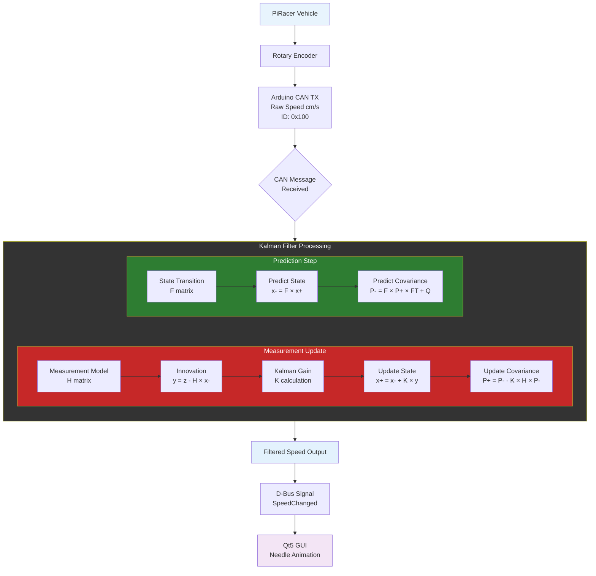
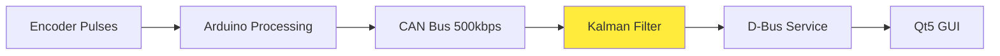

## Kalman Filter Implementation

### PiRacer Speed Estimation System



### System Overview



### Kalman Filter Parameters

| Parameter | Value | Description |
|-----------|-------|-------------|
| **State Vector** | `[velocity, acceleration]` | 2-state kinematic model |
| **Process Noise** | `Q = 4.0` | Vehicle dynamics uncertainty |
| **Measurement Noise** | `R = 3.0` | Encoder quantization noise |
| **Update Rate** | `20-50Hz` | Adaptive time step |
| **Settling Time** | `<200ms` | Response characteristic |
| **Overshoot** | `<2%` | Step response |

### State Equations

**State Transition Matrix:**
```
F = [1  Δt]
    [0   1]
```

**Measurement Matrix:**
```
H = [1  0]  (only velocity measured)
```

**Process Noise Covariance:**
```
Q = [Δt⁴/4  Δt³/2] × σ²
    [Δt³/2   Δt²]
```

### Implementation Steps

1. **Prediction Step:**
   - State: `x[k|k-1] = F × x[k-1|k-1]`
   - Covariance: `P[k|k-1] = F × P[k-1|k-1] × F^T + Q`

2. **Update Step:**
   - Kalman Gain: `K = P × H^T × (H × P × H^T + R)^-1`
   - State Update: `x[k|k] = x[k|k-1] + K × (z - H × x[k|k-1])`
   - Covariance Update: `P[k|k] = (I - K × H) × P[k|k-1]`

### Performance Benefits

- **Noise Reduction**: Eliminates encoder quantization effects
- **Smooth Output**: No abrupt speed changes in GUI
- **Predictive**: Estimates acceleration for better tracking
- **Adaptive**: Handles variable CAN timing (20-50Hz)
- **Real-time**: Sub-millisecond processing per update

### Code Implementation

```python
class KalmanSpeedFilter:
    def __init__(self):
        self.x = np.zeros((2, 1))  # [velocity, acceleration]
        self.P = np.eye(2) * 100.0  # Initial uncertainty
        
    def update(self, measured_speed, dt):
        # Predict
        self.x = self.F @ self.x
        self.P = self.F @ self.P @ self.F.T + self.Q
        
        # Update
        y = measured_speed - self.H @ self.x
        K = self.P @ self.H.T / (self.H @ self.P @ self.H.T + self.R)
        self.x += K * y
        return self.x[0, 0]  # Return filtered velocity
```
