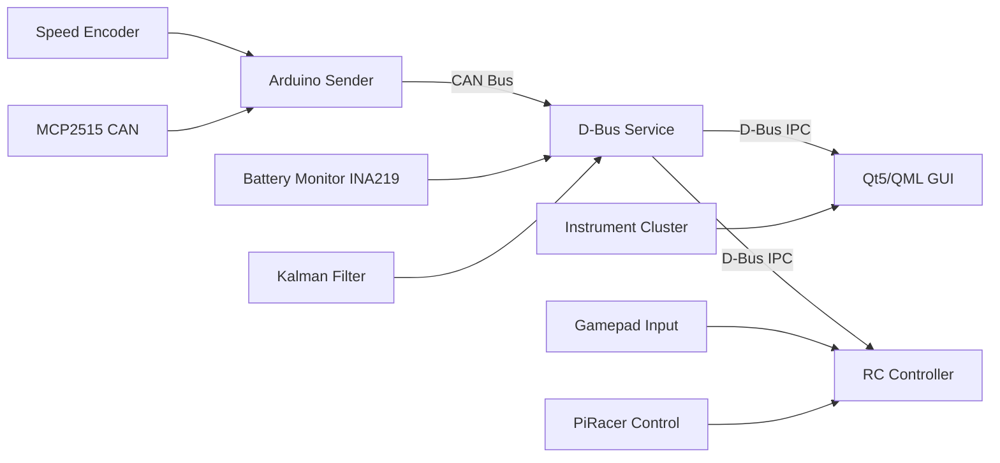
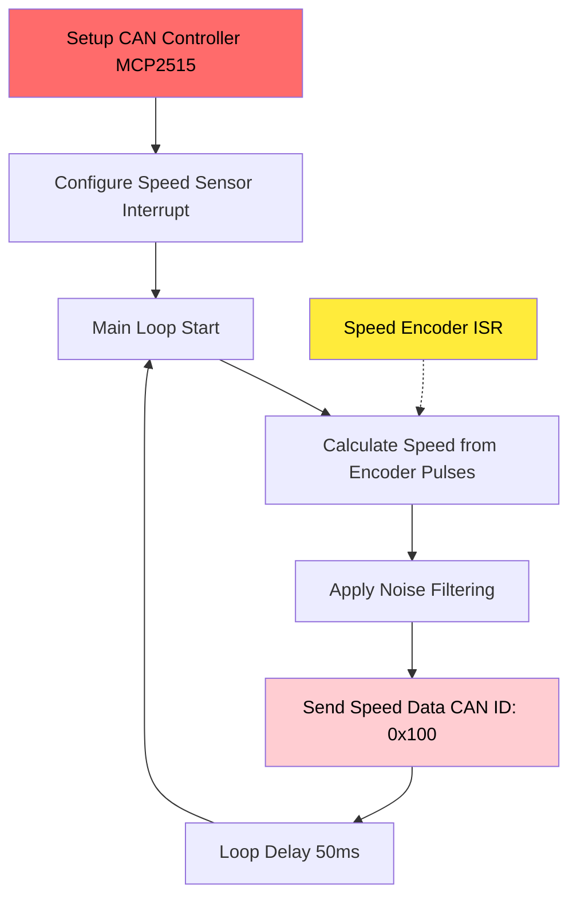
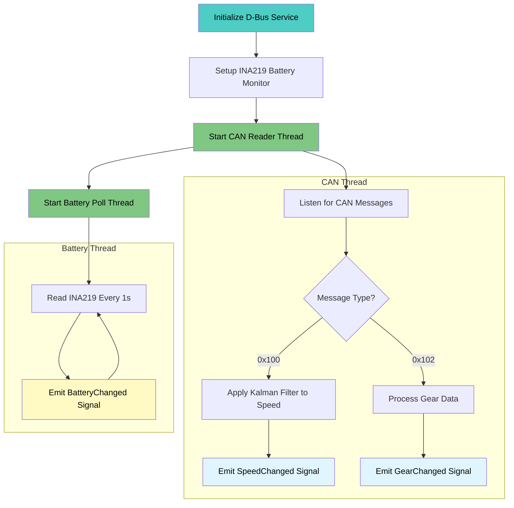
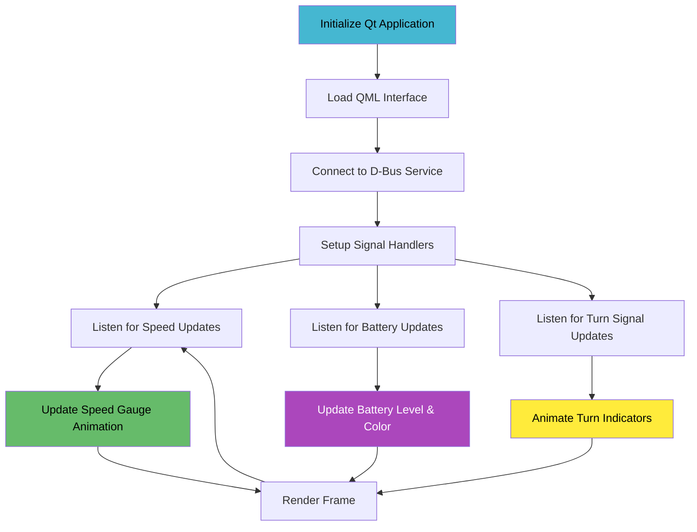
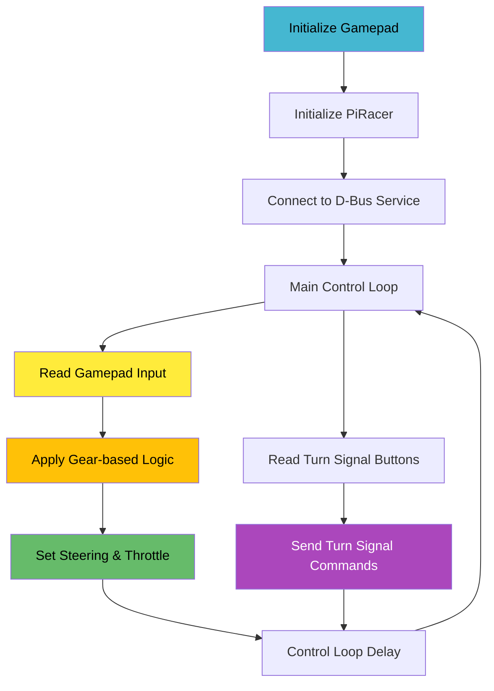
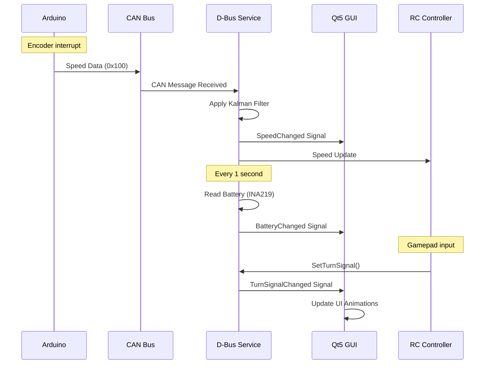
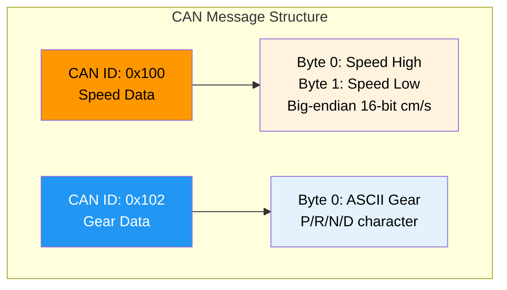
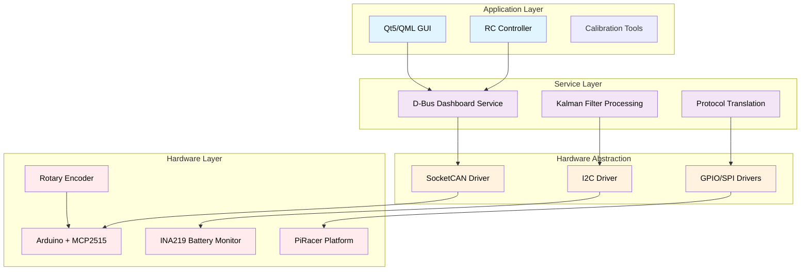

# PiRacer Instrument Cluster

A modern, real-time instrument cluster GUI for PiRacer vehicles, featuring speed monitoring, battery level display, gear indication, and turn signals. Built with Qt5/QML and designed for cross-compilation to Raspberry Pi 4.


## System Overview



## Features

- **Real-time Speed Display**: Speed monitoring in cm/s with Kalman filtering for smooth readings
- **Battery Level Indicator**: Visual battery percentage with color-coded status
- **Gear Display**: Shows current gear (P/R/N/D) with dynamic animations  
- **Turn Signal Indicators**: Left/right turn signals and hazard lights with blinking animations
- **Calibration Overlay**: Press F1 for debug information and speed calibration visualization
- **Cross-Platform**: Runs on development machine and cross-compiles for Raspberry Pi 4

## Architecture Components

### 1. Arduino Sensor Node (Real-time Processing)



### 2. D-Bus Service (Protocol Bridge)



### 3. Qt5/QML Instrument Cluster



### 4. RC Controller (Optional)



## Data Communication Flow



## CAN Message Protocol



## Hardware Requirements

### Raspberry Pi 4
- Raspberry Pi 4 (4GB+ recommended)
- MicroSD card (32GB+)
- CAN HAT or MCP2515 CAN module
- INA219 current/voltage sensor (I2C address 0x41)
- Display (HDMI or DSI touchscreen)

### Arduino Speed Sensor
- Arduino Uno/Nano
- MCP2515 CAN module (16MHz crystal, 500kbps)
- Rotary encoder (40 pulses per revolution)
- Wheel diameter: 64mm

### RC Controller (Optional)
- USB gamepad/joystick for manual control

## Software Dependencies

### Raspberry Pi
```bash
# Qt5 and development tools
sudo apt update
sudo apt install qtbase5-dev qtdeclarative5-dev qtquickcontrols2-5-dev
sudo apt install libqt5dbus5 qml-module-qtgraphicaleffects
sudo apt install python3-pip python3-dbus python3-gi

# Python dependencies
pip3 install python-can adafruit-circuitpython-ina219 pygame numpy

# CAN utilities
sudo apt install can-utils
```

### Development Machine (Cross-compilation)
```bash
# Cross-compilation tools
sudo apt install gcc-aarch64-linux-gnu g++-aarch64-linux-gnu
sudo apt install qtbase5-dev-tools pkgconf pkg-config cmake
```

## Installation & Setup

### 1. Clone Repository
```bash
git clone <repository-url>
cd instrument-cluster
```

### 2. Cross-Compilation Setup

Create sysroot directory and copy libraries from your Raspberry Pi:
```bash
mkdir -p ~/rpi-sysroot
export RPI_SYSROOT=$HOME/rpi-sysroot
rsync -avz --rsync-path="sudo rsync" team3@<PI_IP>:/lib ~/rpi-sysroot/
rsync -avz --rsync-path="sudo rsync" team3@<PI_IP>:/usr/include ~/rpi-sysroot/usr/
rsync -avz --rsync-path="sudo rsync" team3@<PI_IP>:/usr/lib ~/rpi-sysroot/usr/
```

### 3. Build for Raspberry Pi
```bash
cd GUI/CLuster_0827
chmod +x build-rpi.sh
./build-rpi.sh
```

### 4. Deploy to Raspberry Pi
```bash
# Copy binary
scp build-rpi/ClusterUI_0820 team3@<PI_IP>:~/

# Copy Arduino firmware
scp SpeedToCAN.ino team3@<PI_IP>:~/

# Copy Python services  
scp complete_dashboard_service.py team3@<PI_IP>:~/
scp rc_piracer.py team3@<PI_IP>:~/
```

## Configuration

### CAN Interface Setup (Raspberry Pi)
```bash
# Enable SPI
sudo raspi-config
# Interface Options → SPI → Enable

# Configure CAN interface
sudo ip link set can0 down
sudo ip link set can0 type can bitrate 500000
sudo ip link set can0 up
```

Make permanent by adding to `/etc/rc.local`:
```bash
ip link set can0 up type can bitrate 500000
```
## Usage

### Running the System

1. **Start Dashboard Service** (on Pi):
   ```bash
   python3 complete_dashboard_service.py --debug
   ```

2. **Start RC Controller** (optional):
   ```bash
   python3 rc_piracer.py
   ```

3. **Launch GUI**:
   ```bash
   ./ClusterUI_0820
   ```

### Controls

#### Keyboard Shortcuts
- **F1**: Toggle calibration overlay (shows raw vs filtered speed, needle angle visualization)
- **F2**: Toggle turn signal indicators visibility

#### Gamepad Controls (RC Mode)
- **Left Stick**: Steering
- **Right Trigger**: Throttle (limited to 60% max)
- **D-Pad**: 
  - Up: Drive (D)
  - Down: Reverse (R)  
  - Left: Park (P)
  - Right: Neutral (N)
- **Left Bumper**: Left turn signal toggle
- **Right Bumper**: Right turn signal toggle
- **Both Bumpers**: Hazard lights

## Technical Details

### Speed Measurement & Filtering
- Arduino reads rotary encoder pulses (40 PPR)
- Converts to cm/s using 64mm wheel circumference
- Transmits via CAN (ID 0x100, 500 kbps, 20Hz)
- 2-state Kalman filter (velocity, acceleration) smooths readings on Pi
- Timeout-based zero forcing for stopped vehicle detection

### Battery Monitoring
- INA219 sensor on I2C address 0x41
- 3S Li-ion chemistry (9.0V - 12.6V range)
- 1Hz polling rate with D-Bus signal emission

### Communication Protocols

#### CAN Messages
- **0x100**: Speed data (16-bit big-endian, cm/s)
- **0x102**: Gear data (8-bit ASCII: P/R/N/D)

#### D-Bus Interface
```
Service: com.piracer.dashboard
Object: /com/piracer/dashboard

Methods:
- GetSpeed() → double (cm/s)
- GetBatteryLevel() → double (0-100%)
- GetGear() → string (P/R/N/D)
- SetGear(string) → void
- SetTurnSignal(string) → void (off/left/right/hazard)
- GetTurnSignal() → string

Signals:
- SpeedChanged(double)
- BatteryChanged(double)
- GearChanged(string)
- TurnSignalChanged(string)
```

### Performance Optimizations
- Cross-compiled with Cortex-A72 optimizations (`-mcpu=cortex-a72`)
- Release builds use aggressive optimizations (`-O3 -ffast-math`)
- Qt5 property bindings for smooth 60 FPS animations
- Efficient D-Bus signal handling with GLib main loop integration

## System Architecture Layers



## Troubleshooting

### Build Issues
```bash
# Check cross-compilation toolchain
aarch64-linux-gnu-gcc --version

# Verify sysroot Qt5 libraries
ls ~/rpi-sysroot/usr/lib/aarch64-linux-gnu/libQt5*

# Clean build
rm -rf build-rpi && ./build-rpi.sh
```

### Runtime Issues
```bash
# Check CAN interface status
ip link show can0
candump can0

# Test D-Bus service connectivity
dbus-send --session --dest=com.piracer.dashboard \
  --type=method_call /com/piracer/dashboard \
  com.piracer.dashboard.GetSpeed

# Monitor system resources
htop
journalctl -f -u dashboard.service
```

### Common Problems

1. **"Binary might not be properly cross-compiled"**
   - Verify sysroot contains aarch64 libraries: `file ~/rpi-sysroot/usr/lib/aarch64-linux-gnu/libQt5Core.so.5`
   - Check toolchain installation: `which aarch64-linux-gnu-gcc`

2. **"CAN connection failed"**
   - Ensure CAN interface is up: `sudo ip link set can0 up type can bitrate 500000`
   - Check MCP2515 wiring and SPI configuration
   - Verify CAN traffic: `candump can0`

3. **"Qt host tools not found"**
   - Install host tools: `sudo apt install qtbase5-dev-tools`
   - Verify moc location: `which moc`

4. **"SpeedChanged signal not received"**
   - Check Arduino CAN transmission: Look for TX debug output
   - Verify Kalman filter isn't over-smoothing
   - Test with `--debug` flag to see raw vs filtered values

## Development

### File Structure
```
├── GUI/CLuster_0827/
│   ├── main.cpp                    # Qt application entry point
│   ├── main.qml                    # QML UI with gauges and animations
│   ├── PiRacerBridge.{cpp,h}       # D-Bus to Qt property bridge
│   ├── CMakeLists.txt              # Build configuration with pkg-config
│   ├── build-rpi.sh                # Cross-compilation script
│   └── cmake/RPiToolchain.cmake    # Cross-compilation toolchain
├── complete_dashboard_service.py   # D-Bus service with Kalman filtering
├── rc_piracer.py                   # Gamepad controller with throttle limiting
├── SpeedToCAN.ino                  # Arduino encoder to CAN firmware
└── qml.qrc                        # Qt resource file for assets
```

### Key Design Decisions
- **Kalman Filtering**: 2-state filter (velocity, acceleration) for smooth speed readings
- **Cross-Platform Build**: CMake with pkg-config for reliable Qt5 detection
- **Manual MOC/RCC**: Explicit Qt tool invocation for cross-compilation compatibility
- **Throttle Safety**: 60% maximum throttle limit in RC controller
- **CAN Auto-Detection**: Prefers can0 over can1, supports environment override

### Contributing

1. Fork the repository
2. Create a feature branch
3. Test on both development machine and Raspberry Pi hardware
4. Verify CAN communication with `candump can0`
5. Test D-Bus interface with `dbus-monitor --session`
6. Submit pull request with detailed description

### Performance Monitoring
```bash
# Monitor CAN traffic
candump can0 | grep "100\|102"

# Watch D-Bus signals
dbus-monitor --session "interface='com.piracer.dashboard'"

# Check Kalman filter performance (enable --debug flag)
python3 complete_dashboard_service.py --debug

# Profile Qt application
perf record ./ClusterUI_0820
```

## Quick Start

1. **Arduino Setup**: Upload `SpeedToCAN.ino` with MCP_CAN library
2. **Pi Setup**: Configure CAN interface and install dependencies
3. **Cross-compile**: Run `./build-rpi.sh` and deploy binary
4. **Launch**: Start dashboard service, then Qt GUI

Built using:
- Qt5 framework for cross-platform GUI
- D-Bus for inter-process communication
- SocketCAN for automotive-grade networking
- Kalman filtering for robust signal processing
- CMake with pkg-config for reliable cross-compilation
