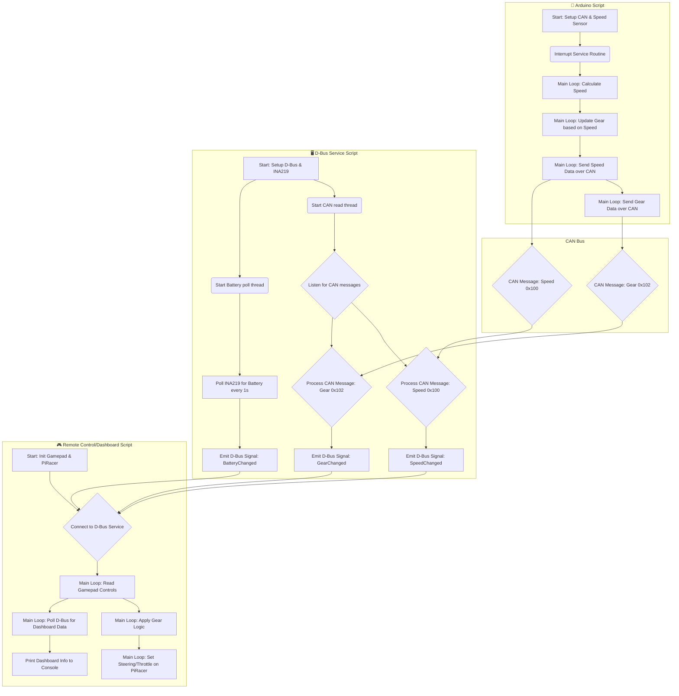

Instrument-Cluster

Aim is to create a real time speedometer in Instrument CLuster for pi-racer.

```mermaid
graph TD
    subgraph Arduino_Sender ["🤖 Arduino Script"]
        A[Start: Setup CAN & Speed Sensor] --> B(Interrupt Service Routine)
        B --> C[Main Loop: Calculate Speed]
        C --> D[Main Loop: Update Gear based on Speed]
        D --> E[Main Loop: Send Speed Data over CAN]
        E --> F[Main Loop: Send Gear Data over CAN]
    end
    
    subgraph CAN_Bus ["CAN Bus"]
        G{CAN Message: Speed 0x100}
        H{CAN Message: Gear 0x102}
    end
    
    subgraph D_Bus_Service ["🖥️ D-Bus Service Script"]
        I[Start: Setup D-Bus & INA219] --> J(Start CAN read thread)
        I --> K(Start Battery poll thread)
        J --> L{Listen for CAN messages}
        K --> M[Poll INA219 for Battery every 1s]
        L --> N{Process CAN Message: Speed 0x100}
        L --> O{Process CAN Message: Gear 0x102}
        M --> P[Emit D-Bus Signal: BatteryChanged]
        N --> Q[Emit D-Bus Signal: SpeedChanged]
        O --> R[Emit D-Bus Signal: GearChanged]
    end
    
    subgraph Remote_Control_Dashboard ["🎮 Remote Control/Dashboard Script"]
        S[Start: Init Gamepad & PiRacer] --> T{Connect to D-Bus Service}
        T --> U[Main Loop: Read Gamepad Controls]
        U --> V[Main Loop: Apply Gear Logic]
        V --> W[Main Loop: Set Steering/Throttle on PiRacer]
        U --> X[Main Loop: Poll D-Bus for Dashboard Data]
        X --> Y[Print Dashboard Info to Console]
    end
    
    %% Inter-subsystem connections
    E --> G
    F --> H
    G --> N
    H --> O
    Q --> T
    R --> T
    P --> T
```
