# Instrument Cluster Project

## System Overview

```mermaid
graph LR
    A[🤖 Arduino Sender] -->|CAN Bus| B[🖥️ D-Bus Service]
    B -->|D-Bus IPC| C[🎮 Control Dashboard]
    
    A1[Speed Sensor] --> A
    A2[Gear Logic] --> A
    
    B1[Battery Monitor] --> B
    B2[CAN Bridge] --> B
    
    C1[Gamepad Input] --> C
    C2[PiRacer Control] --> C
```

---

## 1. Arduino Sensor Node (Real-time Processing)

```mermaid
flowchart TD
    A[🔧 Setup CAN Controller] --> B[⚡ Configure Speed Sensor Interrupt]
    B --> C[🔄 Main Loop Start]
    
    C --> D[📊 Calculate Speed from Pulses]
    D --> E[⚙️ Determine Gear from Speed]
    E --> F[📡 Send Speed Data CAN ID: 0x100]
    F --> G[📡 Send Gear Data CAN ID: 0x102]
    G --> H[⏱️ Loop Delay]
    H --> C
    
    I[⚡ Speed Sensor ISR] -.-> D
    
    style A fill:#ff6b6b,color:#000
    style I fill:#ffeb3b,color:#000
    style F fill:#ffcdd2,color:#000
    style G fill:#ffcdd2,color:#000
```

---

## 2. D-Bus Service (Protocol Bridge)

```mermaid
flowchart TD
    A[🔧 Initialize D-Bus Service] --> B[🔌 Setup INA219 Battery Monitor]
    B --> C[🧵 Start CAN Reader Thread]
    C --> D[🧵 Start Battery Poll Thread]
    
    subgraph "CAN Thread"
        E[📥 Listen for CAN Messages] --> F{Message Type?}
        F -->|0x100| G[📊 Process Speed Data]
        F -->|0x102| H[⚙️ Process Gear Data]
        G --> I[📢 Emit SpeedChanged Signal]
        H --> J[📢 Emit GearChanged Signal]
    end
    
    subgraph "Battery Thread"
        K[🔋 Read INA219 Every 1s] --> L[📢 Emit BatteryChanged Signal]
        L --> K
    end
    
    C --> E
    D --> K
    
    style A fill:#4ecdc4,color:#000
    style C fill:#81c784,color:#000
    style D fill:#81c784,color:#000
    style I fill:#e1f5fe,color:#000
    style J fill:#e1f5fe,color:#000
    style L fill:#fff9c4,color:#000
```

---

## 3. Control Dashboard (User Interface)

```mermaid
flowchart TD
    A[🔧 Initialize Gamepad] --> B[🚗 Initialize PiRacer]
    B --> C[🔗 Connect to D-Bus Service]
    C --> D[🔄 Main Control Loop]
    
    D --> E[🎮 Read Gamepad Input]
    E --> F[⚙️ Apply Gear-based Logic]
    F --> G[🚗 Set Steering & Throttle]
    
    D --> H[📊 Poll D-Bus Telemetry]
    H --> I[📺 Update Dashboard Display]
    
    G --> J[⏱️ Control Loop Delay]
    I --> J
    J --> D
    
    style A fill:#45b7d1,color:#000
    style G fill:#66bb6a,color:#000
    style I fill:#ab47bc,color:#fff
    style E fill:#ffeb3b,color:#000
    style F fill:#ffc107,color:#000
```

---

## 4. Data Communication Flow

---

## 5. CAN Message Protocol

---

## 6. System Architecture Layers

---

## Quick Start

1. **Arduino Setup**: Upload sensor code with CAN library
2. **D-Bus Service**: Run Python service script with root privileges
3. **Dashboard**: Launch control interface with gamepad connected

## Hardware Requirements

- Arduino Uno with CAN shield
- Speed sensor (Hall effect or optical encoder)
- INA219 current/voltage sensor
- PiRacer platform
- USB gamepad controller

## Software Dependencies

- Arduino: `mcp_can.h` library
- Python: `python-can`, `dbus-python`, `pygame`
- System: `can-utils` for debugging
